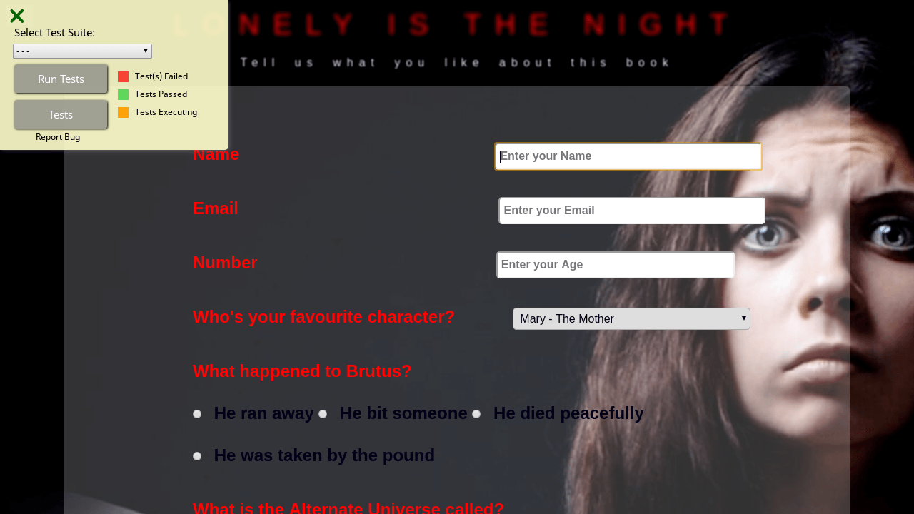

# FCC (FreeCodeCamp) Survy Form

## Project Objective
Build an app that is *functionally* similar to this: https://codepen.io/freeCodeCamp/full/VPaoNP.

***

## Requirements
#### Requirement Number One:
A ```title with id="title"``` in ```H1``` tag. A short explanation with ```id="description"``` in ```P``` tag.

#### Requirement Number Two: 
Needs to have a ```form``` element with ```id="survey-form"```. Inside the form element, a ```field``` with ```id="name"```, ```email``` in a field with ```id="email"```, ```number``` in a field with ```id="number"```. If the fields are not formatted correctly or the range of number input defined by ```min / max``` attributes, I will have an HTML5 validation error.

#### Requirement Number Three: 
Inside the form I can see corresponding ```labels``` that describe the purpose of each field with the following ```ids: id="name-label", id="email-label", and id="number-label"```, along with ```placeholder text``` that gives me a description or instructions for each field.

#### Requirement Number Four: 
Inside the form element, I can select an option from a ```dropdown``` with the ```id="dropdown"```. I can aslo select a field from one or more groups of ```radio buttons``` and grouped using a name attribute. I should be able to select several fields from a series of ```checkboxes```, with a value attribute.

#### Requirement Number Five: 
Inside the form, I should have a ```textarea``` at the end for additional comments. And I should see a ```button``` with ```id="submit"``` to submit all my inputs.

***


## Project Install Requirements

- **NodeJS - [NodeJS](http://nodejs.org)** - Follow the prompts to install
- **Gulp - [GulpJS](https://gulpjs.com/)**
```
npm install -g gulp
```

***

## Start Project
Run the following command: 
```
npm install
```

***

## How to use the project
Open your terminal and type gulp. This will run the ```gulpfile``` and ensure that all the compilers are working and watching for any changes taking place.

Here are other commands that you can run.

* **default**: Compile and watch for changes
* **scripts**: Compile the JavaScript files
* **sass**: Compile the Sass styles
* **images**: Copy the newer to the build folder
* **vendors**: Copy the vendors to the build folder
* **watch**: Watch for any changes on the each section

The `gulp` command is the best choice for you most likley.

***

## Project Starter Kit
Courtesy of: **Jesse Showalter** 
Go check out his [YouTube](https://www.youtube.com/watch?v=sr6jDeAoXCc&feature=youtu.be&list=PLrtjkLnNjGHu7QIc8jN7hZmuP6wMby2QZ) channel for more information and awesome content.

## Project Thumbnails:




